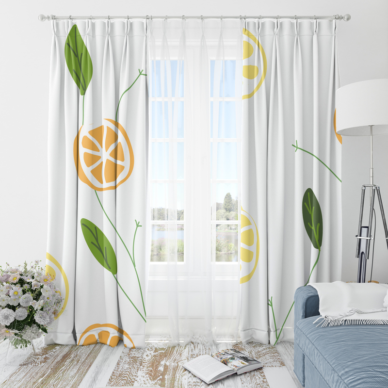
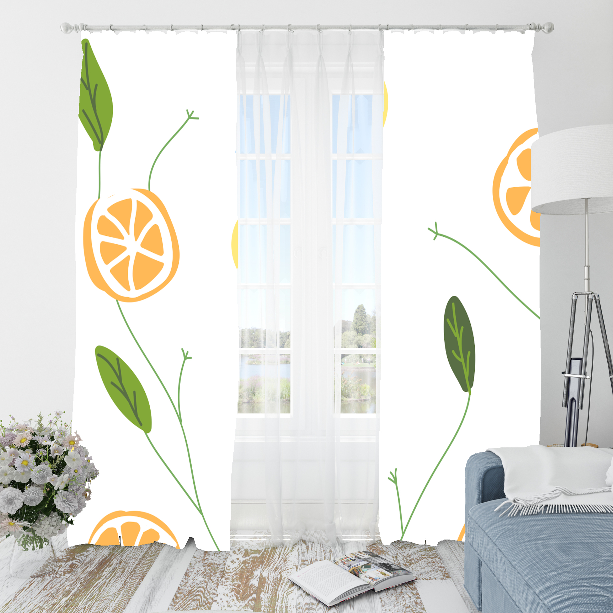
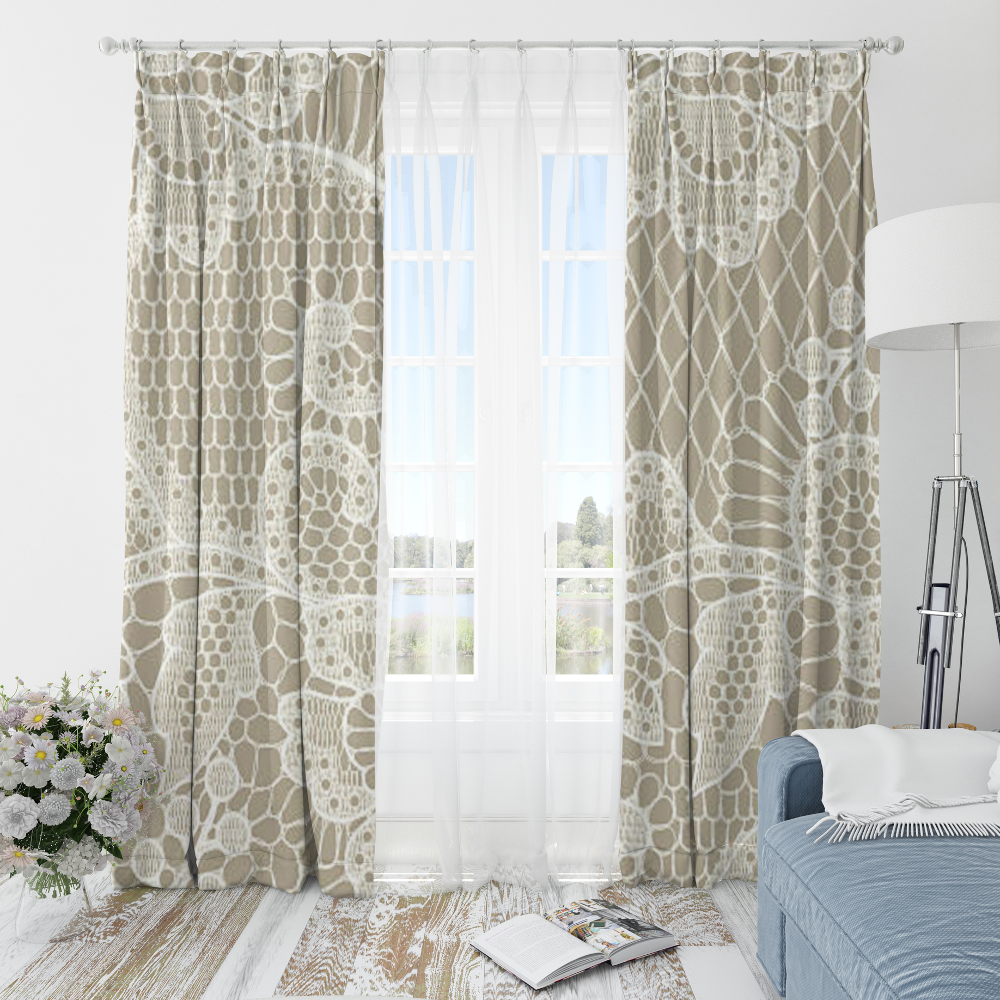

# Product Mockup Generator - Windows Setup Guide

This guide explains how to set up and run the Product Mockup Generator on Windows systems.

## 🎯 What This Does

This tool automatically generates realistic product mockups by:
- Applying custom artwork to product templates
- Adding perspective transformation to match product shape
- Applying displacement mapping for fabric texture
- Adding lighting and shadow effects
- Adjusting colors to match product material

## 🖼️ Demo Images

Here are some examples of mockups generated with this tool:

### Generated Mockups:
-  - Generated via Linux shell (WSL2 Ubuntu)
-  - Basic mockup with sample artwork
-  - Mockup with different artwork placement
-  - Mockup with enhanced lighting effects
*These images demonstrate the tool's ability to create realistic product mockups with proper perspective, lighting, and texture effects.*

## 📋 Prerequisites

### Required Software:
1. **Node.js** (v16 or higher) - [Download here](https://nodejs.org/)
2. **ImageMagick** (v7 or higher) - [Download here](https://imagemagick.org/script/download.php#windows)

### ImageMagick Installation Steps:
1. Go to https://imagemagick.org/script/download.php#windows
2. Download the **Windows 64-bit installer** (e.g., `ImageMagick-7.x.x-Q16-HDRI-x64-dll.exe`)
3. **IMPORTANT**: During installation, check **"Add to system PATH"**
4. Restart your terminal/command prompt after installation
5. Verify installation: `magick -version`
6. Fix permission erorr for the whole setup: sudo chown -R $USER:$USER .
## 🚀 Quick Start

### Step 1: Clone and Setup
```bash
# Clone the repository
git clone https://github.com/your-username/product-mockup-generator.git
cd product-mockup-generator
cd /home/anya/mockup_scripts
# Navigate to the mockup directory
cd mockup
```

### Step 2: Generate Required Maps
```bash
# Create necessary directories
mkdir mpcs maps

# Generate displacement map
magick "base_images\template.jpg" "base_images\mask.png" -alpha off -colorspace gray -compose CopyOpacity -composite "mpcs\normalized_template_map_tmp.mpc"
magick "mpcs\normalized_template_map_tmp.mpc" -evaluate subtract 30% -background grey50 -alpha remove -alpha off "mpcs\generate_displacement_map_tmp.mpc"
magick "mpcs\generate_displacement_map_tmp.mpc" -blur 0x10 "maps\displacement_map.png"

# Generate lighting map
magick "mpcs\normalized_template_map_tmp.mpc" -evaluate subtract 30% -background grey50 -alpha remove -alpha off "mpcs\generate_lighting_map_tmp.mpc"
magick "mpcs\generate_lighting_map_tmp.mpc" `( -clone 0 -fill grey50 -colorize 100 `) -compose lighten -composite "maps\lighting_map.png"

# Generate adjustment map
magick "base_images\template.jpg" `( -clone 0 -fill "#f1f1f1" -colorize 100 `) "base_images\mask.png" -compose DivideSrc -composite "maps\adjustment_map.jpg"
```

### Step 3: Generate Mockups
```bash
# Run the Windows-optimized script
node create_mockup_windows.js
```

### ▶️ WSL2 Ubuntu (Linux) Quick Run

If you are using WSL2 Ubuntu and want to generate a mockup directly from the Linux shell, use the provided script:

```bash
# Ensure the script is executable
chmod +x generate_mockup.sh

# Run with your actual files
./generate_mockup.sh \
  base_images/template.jpg \
  base_images/mask.png \
  swatches/art24.jpg \
  maps/displacement_map.png \
  maps/lighting_map.png \
  maps/adjustment_map.jpg \
  final_shell.jpg
```

This will generate `final_shell.jpg`, which you can find in the project root.

## 📁 File Structure

```
mockup/
├── base_images/
│   ├── template.jpg      # Product template image
│   └── mask.png          # Mask defining where artwork goes
├── swatches/
│   ├── art6.jpg          # Sample artwork 1
│   ├── art9.jpg          # Sample artwork 2
│   └── art11.jpg         # Sample artwork 3
├── maps/                 # Generated automatically
│   ├── displacement_map.png
│   ├── lighting_map.png
│   └── adjustment_map.jpg
├── create_mockup.js          # Original script (Unix/Linux)
├── create_mockup_windows.js  # Windows-optimized script
├── test_setup.js             # Setup verification script
└── README_WINDOWS.md         # This file
```

## 🔧 Configuration

### Customizing Mockup Generation

Edit `create_mockup_windows.js` to change:

```javascript
mockups = {
  'out': "final_js2.jpg",                    // Output filename
  'artwork': "swatches/art6.jpg",            // Your artwork file
  'template': 'base_images/template.jpg',    // Product template
  'mask': 'base_images/mask.png',            // Mask file
  'displacementMap': 'maps/displacement_map.png',
  'lightingMap': 'maps/lighting_map.png',
  'adjustmentMap': 'maps/adjustment_map.jpg'
}
```

### Adding Your Own Artwork

1. Place your artwork files in the `swatches/` directory
2. Update the `artwork` path in the configuration
3. Run the script

### Using Different Product Templates

1. Replace `base_images/template.jpg` with your product image
2. Create a corresponding mask in `base_images/mask.png`
3. Regenerate the maps using Step 2 above

## 🧪 Testing Your Setup

Run the verification script:
```bash
node test_setup.js
```

This will check:
- ✅ ImageMagick installation
- ✅ Required files existence
- ✅ Map generation
- ✅ Mockup generation

## 🐛 Troubleshooting

### Common Issues:

**1. "magick is not recognized"**
- ImageMagick not installed or not in PATH
- Solution: Reinstall ImageMagick with "Add to system PATH" checked

**2. "File not found" errors**
- Check that all required files exist in correct locations
- Verify file paths in configuration

**3. "Permission denied" errors**
- Run PowerShell as Administrator
- Check file permissions

**4. Artwork not properly positioned**
- Ensure mask file matches template dimensions
- Verify artwork is being scaled correctly

### Debug Mode

Enable detailed logging by uncommenting console.log statements in the script.

## 📈 Features

### Windows Optimizations:
- ✅ Proper path handling with backslashes
- ✅ Escaped parentheses for PowerShell compatibility
- ✅ Incremental file naming (prevents overwriting)
- ✅ Automatic artwork scaling to mask dimensions
- ✅ Temporary file cleanup

### Advanced Features:
- ✅ Perspective transformation
- ✅ Displacement mapping
- ✅ Lighting effects
- ✅ Color adjustment
- ✅ Batch processing capability

## 🔄 Integration with Your Projects

### For Node.js/TypeScript Projects:

```javascript
const { generateMockup } = require('./create_mockup_windows.js');

// Generate mockup programmatically
const result = await generateMockup({
  artwork: 'path/to/your/artwork.jpg',
  template: 'path/to/template.jpg',
  mask: 'path/to/mask.png',
  out: 'output_mockup.jpg'
});
```

### For Web Applications:

Use the provided `mockup-api-example.ts` for a complete REST API.

## 📝 License

This project is based on the original [product-mockup-node-python](https://github.com/kashifulhaque/product-mockup-node-python) repository.

## 🤝 Contributing

1. Fork the repository
2. Create a feature branch
3. Make your changes
4. Test thoroughly on Windows
5. Submit a pull request

## 📞 Support

If you encounter issues:
1. Check the troubleshooting section above
2. Verify ImageMagick installation
3. Run the test script
4. Create an issue with detailed error information

---

**Happy Mockup Generating! 🎨**
